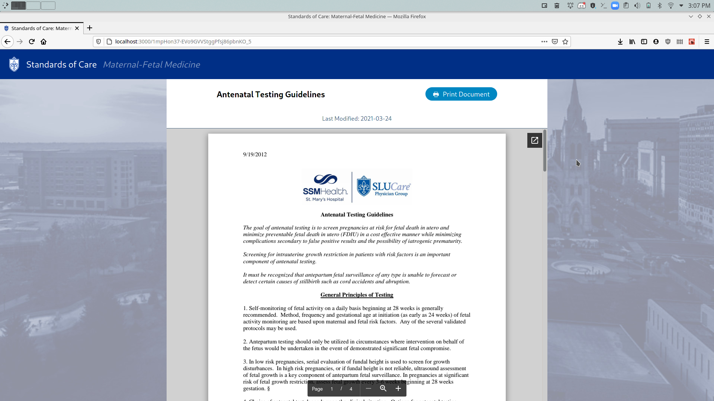

# CSCI Capstone: Standards of Care
Standards of Care is a lightweight web app designed in **ReactJS** for use within SLUCare by the *Maternal-Fetal Medicine* staff. The web app allows for easy access by staff and patients to documents detailing care guidelines through the **Google Drive API**.

Standards of Care allows users to search, view, and print such documents, and staff can update, delete, or create new guideline documents.

## Live Demo
> [standards-of-care.github.io](http://standards-of-care.github.io)

## Screenshots

